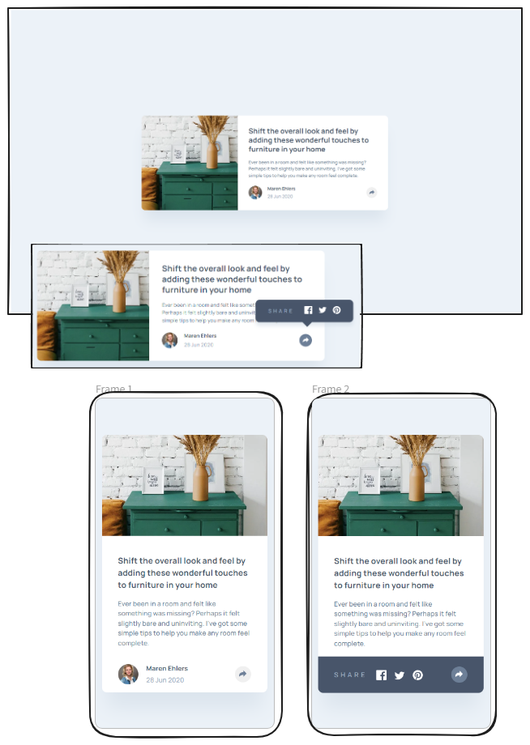

# Frontend Mentor - Article preview component solution

This is a solution to the [Article preview component challenge on Frontend Mentor](https://www.frontendmentor.io/challenges/article-preview-component-dYBN_pYFT). Frontend Mentor challenges help you improve your coding skills by building realistic projects.

## Table of contents

- [Overview](#overview)
  - [The challenge](#the-challenge)
  - [Screenshot](#screenshot)
  - [Links](#links)
- [My process](#my-process)
  - [Built with](#built-with)
  - [What I learned](#what-i-learned)
  - [Continued development](#continued-development)
  - [Useful resources](#useful-resources)
- [Author](#author)

## Overview

### The challenge

Users should be able to:

- View the optimal layout for the component depending on their device's screen size
- See the social media share links when they click the share icon

### Screenshot

### Links

- Live Site URL: [Article preview component / Vercel deployment](https://fm-article-preview-component-khaki.vercel.app/)

## My process

### Built with

- Semantic HTML5 markup
- CSS custom properties
- Flexbox
- Mobile-first workflow

### What I learned

Instead of including an SVG as src in the img-tag, I inserted the SVG directly into the button element. This allowed me to address the fill value directly in the CSS.

### Continued development

Maybe there could better approaches for the article-footer, displaying the share-popup and toggeling show and hide. I will be looking for suggestions for this in the future and collecting other ideas.

### Useful resources

- [Popup with arrow](https://www.w3schools.com/howto/howto_js_popup.asp) - Using this documentation for CSS and the Share-Popup

## Author

- Frontend Mentor - [@MarenOelixtown](https://www.frontendmentor.io/profile/MarenOelixtown)
